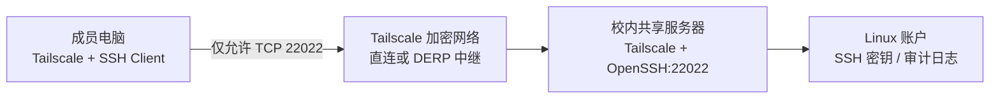

# 使用 Tailscale 安全访问校内多人共享服务器
## 背景

实验室有一台多人共享的 Linux 计算服务器，仅能从校园网访问。需求是在校外通过 SSH 安全访问它，同时满足以下约束：

- 不把 SSH 端口直接暴露到公网；
- 不依赖公网端口转发或脆弱的反向代理；
- 每位成员继续使用独立 Linux 账户和 SSH 密钥；
- 不破坏原有校园网访问方式；
- 能够集中撤销成员或设备的远程访问权限。

最终采用 **Tailscale 负责网络层，OpenSSH 负责身份认证** 的方案。

> [!important] 多人服务器的关键选择
> 不启用 Tailscale SSH。Tailscale 只建立 WireGuard 加密网络，登录认证继续由系统 OpenSSH、Linux 账户和 `authorized_keys` 完成。

## 架构



权限被分成三层：

1. **Tailscale 身份与 ACL**：成员是否能够到达服务器的 SSH 端口；
2. **OpenSSH**：成员是否持有对应 Linux 账户的有效私钥；
3. **Linux 权限**：登录后能够访问哪些文件、任务和设备。

这样，即使某台设备加入 Tailnet，也不会自动获得服务器账户权限；反过来，知道 Linux 密码或拥有旧密钥的设备，如果未通过 Tailscale ACL，也无法从校外到达 SSH 服务。

## 为什么选择 Tailscale

与直接公网映射、FRP 或自建中转相比，Tailscale 的主要优势是：

- 服务器主动建立出站连接，通常无需开放校园网入站端口；
- 优先尝试端到端直连，失败后自动使用 DERP 中继；
- WireGuard 提供端到端加密；
- 可按用户、设备、标签和端口实施最小权限；
- 成员离组或设备丢失后，可在管理后台快速撤销权限。

自建 WireGuard 或云服务器中转拥有更高控制权，但还需要维护公网主机、防火墙、密钥轮换和隧道保活。对于仅需 SSH 的场景，Tailscale 的维护成本更低。

## 一、服务端安装与上线

服务器以 Debian/Ubuntu 为例。安装方式以 [Tailscale 官方安装文档](https://tailscale.com/download/linux) 为准。

安装后将服务器加入 Tailnet：

```bash
sudo tailscale up --hostname=lab-cpu
```

浏览器完成身份认证后检查状态：

```bash
tailscale status
tailscale ip -4
tailscale netcheck
```

示例结果：

```text
100.64.10.20  lab-cpu          admin@example.com  linux    -
100.64.10.30  research-laptop  alice@example.com  windows  -
```

确保没有启用 Tailscale SSH：

```bash
sudo tailscale set --ssh=false
```

这条命令不会关闭 Tailscale，只会确保 Tailscale 不接管 SSH 认证。

> [!warning] 不要共享管理员账号
> 每位成员应使用自己的 Tailscale 身份加入 Tailnet，不能共用管理员邮箱、浏览器会话或认证密钥。

## 二、确认服务器 SSH 监听端口

不要默认认为 SSH 一定监听 22。先检查实际端口：

```bash
systemctl status ssh --no-pager -l
ss -lntp | grep ssh
```

如果普通用户看不到进程名，可以只查端口：

```bash
ss -lnt | grep LISTEN
```

本例服务器使用非标准端口 `22022`：

```text
LISTEN 0 128 0.0.0.0:22022 0.0.0.0:*
LISTEN 0 128 [::]:22022    [::]:*
```

这表示 OpenSSH 同时监听所有 IPv4 和 IPv6 接口，包括 `tailscale0`。因此后续 SSH 命令和 Tailscale ACL 都必须使用 `22022`。

## 三、Windows 客户端测试

安装并登录 Tailscale 后，在 PowerShell 测试网络层：

```powershell
tailscale ping lab-cpu
```

直连示例：

```text
pong from lab-cpu (100.64.10.20) via 10.0.0.25:41641 in 6ms
```

如果显示 `via DERP(...)`，连接仍然安全可用，但流量经过 Tailscale 中继，延迟和带宽可能不如直连。

确认 SSH 端口可达：

```powershell
Test-NetConnection 100.64.10.20 -Port 22022
```

连接服务器：

```powershell
ssh -p 22022 alice@lab-cpu
```

也可以使用 Tailscale IP：

```powershell
ssh -p 22022 alice@100.64.10.20
```

## 四、配置 Windows OpenSSH

编辑：

```text
%USERPROFILE%\.ssh\config
```

添加：

```sshconfig
Host lab-cpu-remote
    HostName lab-cpu
    Port 22022
    User alice
    IdentityFile ~/.ssh/id_ed25519
    IdentitiesOnly yes
```

以后直接运行：

```powershell
ssh lab-cpu-remote
```

如果还要保留校园网入口，可以配置两个别名：

```sshconfig
Host lab-cpu-campus
    HostName 10.0.0.10
    Port 22022
    User alice
    IdentityFile ~/.ssh/id_ed25519

Host lab-cpu-remote
    HostName lab-cpu
    Port 22022
    User alice
    IdentityFile ~/.ssh/id_ed25519
    IdentitiesOnly yes
```

## 五、多人访问控制

### 1. 每人独立身份

每位成员必须同时拥有：

- 独立的 Tailscale 身份；
- 独立的 Linux 账户；
- 独立生成的 SSH 密钥对。

客户端生成 Ed25519 密钥：

```powershell
ssh-keygen -t ed25519 -a 64
```

不要在成员之间复制私钥。管理员只收集公钥，例如：

```text
id_ed25519.pub
```

### 2. 为服务器添加标签

在 Tailscale 管理后台把服务器标记为：

```text
tag:lab-cpu
```

标签所有者应限制为管理员组，普通成员不能自行给设备添加服务器标签。

### 3. 配置最小权限策略

以下策略只允许实验室成员访问服务器的 TCP `22022`：

```json
{
  "groups": {
    "group:lab-users": [
      "alice@example.com",
      "bob@example.com"
    ],
    "group:lab-admins": [
      "admin@example.com"
    ]
  },

  "tagOwners": {
    "tag:lab-cpu": [
      "group:lab-admins"
    ]
  },

  "grants": [
    {
      "src": [
        "group:lab-users"
      ],
      "dst": [
        "tag:lab-cpu"
      ],
      "ip": [
        "tcp:22022"
      ]
    }
  ]
}
```

> [!danger] 检查默认放行规则
> 如果策略里仍存在从 `*` 到 `*`、端口为 `*` 的全放行规则，上面的最小权限规则就没有达到预期隔离效果。保存 ACL 前应确认管理设备仍有访问路径，避免把自己锁在 Tailnet 外。

如果还需开放 Jupyter、Web 服务或监控端口，应逐项增加明确端口，不要直接允许所有端口。

## 六、OpenSSH 多用户安全建议

服务器继续使用原生 OpenSSH。建议至少确认以下配置：

```text
PermitRootLogin no
PubkeyAuthentication yes
PasswordAuthentication no
KbdInteractiveAuthentication no
```

如果没有 LDAP、域账号或复杂 PAM 规则，可以使用 Linux 组控制 SSH 用户：

```bash
sudo groupadd -f sshusers
sudo usermod -aG sshusers alice
sudo usermod -aG sshusers bob
```

然后在 `/etc/ssh/sshd_config` 中配置：

```text
AllowGroups sshusers
```

修改前先检查已有配置和包含文件：

```bash
grep -RniE '^(Port|ListenAddress|AllowUsers|AllowGroups|PasswordAuthentication|PermitRootLogin)' \
  /etc/ssh/sshd_config /etc/ssh/sshd_config.d 2>/dev/null
```

验证语法后再重载：

```bash
sudo sshd -t
sudo systemctl reload ssh
```

> [!warning] 防止锁死
> 修改 SSH、PAM、防火墙或 Tailscale ACL 时，保留当前管理员会话，并用第二个终端完成一次新登录测试后再退出旧会话。多人生产服务器不应直接套用 `AllowGroups`，必须先核对 LDAP、域账号和现有 PAM 策略。

## 七、故障排查复盘：端口 22 被拒绝

初次测试时，Tailscale 网络正常：

```powershell
tailscale ping lab-cpu
```

返回直连和低延迟：

```text
pong from lab-cpu (100.64.10.20) via 10.0.0.25:41641 in 6ms
```

但 SSH 连接失败：

```powershell
ssh alice@lab-cpu
```

错误为：

```text
ssh: connect to host lab-cpu port 22: Connection refused
```

### 判断

`tailscale ping` 成功，证明：

- 两个节点均已加入 Tailnet；
- 名称解析和 Tailscale 路由正常；
- 数据已经能够到达服务器。

`Connection refused` 与超时不同。它通常表示目标主机已经收到 TCP 请求，但对应端口没有服务监听，或者防火墙明确执行了 Reject。

### 服务端检查

```bash
systemctl status ssh --no-pager -l
ss -lntp | grep ':22'
```

实际输出显示：

```text
LISTEN 0 128 0.0.0.0:22022 0.0.0.0:*
LISTEN 0 128 [::]:22022    [::]:*
```

根因是 OpenSSH 使用 `22022`，而客户端默认连接 `22`。正确命令为：

```powershell
ssh -p 22022 alice@lab-cpu
```

这次排障的关键经验是：

1. 先分离网络层和应用层；
2. `tailscale ping` 只证明 Tailscale 路径正常，不证明 SSH 端口正确；
3. `Connection refused` 优先检查监听地址和端口；
4. 客户端 SSH Config 与 Tailscale ACL 必须使用同一个实际端口。

## 八、日常检查命令

服务器端：

```bash
tailscale status
tailscale ip -4
tailscale netcheck
systemctl status tailscaled --no-pager
systemctl status ssh --no-pager
ss -lntp | grep 22022
```

Windows 客户端：

```powershell
tailscale status
tailscale ping lab-cpu
Test-NetConnection lab-cpu -Port 22022
ssh -v lab-cpu-remote
```

判断连接是否直连：

```powershell
tailscale ping lab-cpu
```

- `via 具体IP:41641`：通常是点对点直连；
- `via DERP(地区)`：通过 DERP 中继；
- 完全无响应：检查设备在线状态、ACL、本机网络和 `tailscaled` 服务。

## 九、安全运维清单

- [ ] 学校或实验室政策允许使用此类远程接入；
- [ ] Tailscale 管理账号已启用 MFA；
- [ ] 开启新设备审批；
- [ ] 每位成员使用独立 Tailscale 身份；
- [ ] 每位成员使用独立 Linux 账户和 SSH 密钥；
- [ ] 服务器未启用 Tailscale SSH；
- [ ] ACL 仅开放 `tcp:22022`；
- [ ] 不存在无必要的全网互通规则；
- [ ] 禁止 root 直接 SSH 登录；
- [ ] 禁止共享私钥、共享 Linux 账号；
- [ ] 成员离组后同步撤销 Tailnet、Linux 账户和 SSH 公钥；
- [ ] 定期检查 Tailscale 设备、ACL 和 `/var/log/auth.log`；
- [ ] 修改关键配置时保留第二条管理员回退连接。

## 总结

对于校内多人共享服务器，Tailscale 最适合承担“安全网络入口”的角色，而不是替代 OpenSSH 的多用户认证体系。最终链路是：

```text
个人设备身份
  → Tailscale ACL 允许访问 tcp:22022
  → OpenSSH 校验个人密钥
  → Linux 账户实施文件和进程权限
```

这种分层方式没有新增公网 SSH 端口，保留了服务器原有的账户和审计机制，也能在成员或设备发生变化时快速撤销网络访问。

## 参考资料

- [Tailscale：Linux 安装](https://tailscale.com/download/linux)
- [Tailscale：访问控制](https://tailscale.com/docs/features/access-control)
- [Tailscale：SSH 功能及多用户限制](https://tailscale.com/docs/features/tailscale-ssh)
- [Tailscale：防火墙端口说明](https://tailscale.com/docs/reference/faq/firewall-ports)
- [OpenSSH sshd_config 手册](https://man.openbsd.org/sshd_config)
