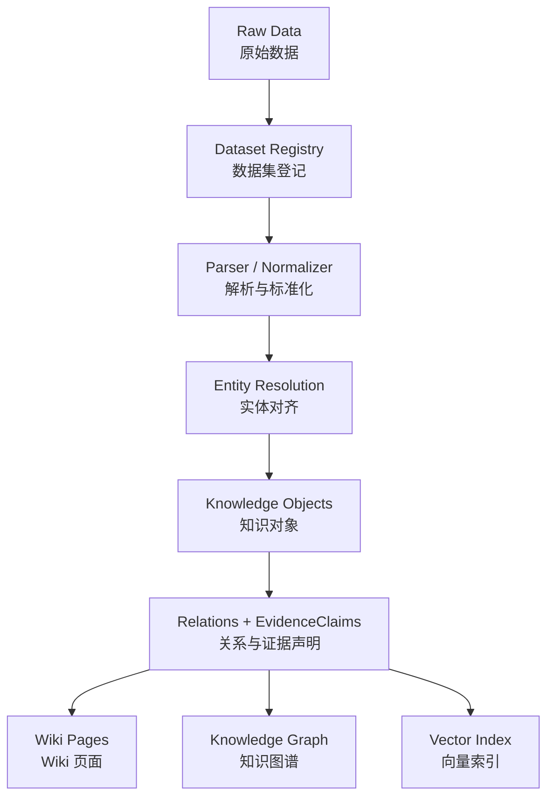

## 1 项目定位

<u>*定义 PlantGeneWiki 的系统身份和边界。*</u>

这不是一个传统意义上的植物基因组数据库。

**PlantGeneWiki**是一个面向植物基因组学智能体的 Wiki 型知识库基础设施。它不是传统字段数据库，也不是单纯文献检索系统，而是以物种、基因、性状、文献、通路、品种、数据集和同源组等知识对象为页面单元，组织可读、可检索、可追溯、可推理的多源知识网络。

---
<font color="#ffc000">科学问题：</font>将大语言模型的可靠推理边界推展至一个现有系统服务不足的复杂作物基因组学领域

<font color="#ffc000">研究思路：</font>整合多种来源知识，构建可自动更新的知识库，并结合多元语义检索、结构化知识图谱查询和大语言模型生成，构建植物知识智能体 

<font color="#4f81bd">例如，油菜领域研究热点变化：</font>
基于筛选文献的关键词，分析油菜遗传学领域的研究热点比那花，“QTL mapping”和“GWAS”等关键词在 2011-2025 年的激增表明油菜二倍体祖先及油菜基因组的发布促进了油菜进化和功能基因组学的发展 

<font color="#4f81bd">例如，油菜文献收集、筛选和评估： </font>
1. 在文献评估过程中，为确保文献质量与覆盖度，要建立一套包含关键词初筛、正则表达式过滤与 SciBert 文本分类模型精筛的自动化筛选流程 
2. 相比传统单阈值方法，基于 SciBERT 模型的双阈值人机协同筛选策略在召回率、准确率、精确率和 F1 分数上均有显著提升，同时大幅降低了人工复核工作量
---
## 2 科学问题
<u>*解释研究动机和学术价值。*</u>

> 如何将大语言模型的可靠推理边界拓展到现有数据库和通用模型服务不足的复杂作物基因组学领域？

在植物基因组学，尤其是油菜等复杂作物研究中，研究问题往往不是单一事实查询，而是跨文献、跨数据库、跨物种、跨证据类型的综合推理。例如：
- 某个基因是否真正参与某个农艺性状的调控？
- 油菜二倍体祖先和甘蓝型油菜基因组发布之后，研究热点如何发生变化？
- 某篇文献中的发现能否被已有知识库中的基因、性状、通路或同源关系验证？

<font color="#ffc000">传统数据库</font>可以回答“已知字段是什么”，但难以回答“多个证据是否共同支持某个生物学假设”。

<font color="#ffc000">通用大语言模型</font>虽然具备语言理解和生成能力，但在复杂作物基因组学中存在明显限制：
1. **领域知识覆盖不足**：对油菜、多倍体作物、亚基因组分化、QTL/GWAS、同源关系等专业知识掌握不稳定。
2. **证据链难以追溯**：模型生成的结论往往缺少明确可靠的来源，难以判断依据来自文献、数据库、推断还是模型幻觉。
3. **结构化关系推理能力不足**：复杂基因组学问题需要在基因、性状、QTL、GWAS 位点、表达谱、同源基因、品种和文献之间进行多跳推理，单纯自然语言生成难以保证可靠性。
4. **知识更新滞后**：油菜等作物领域文献和数据库持续更新，静态模型难以及时吸收新增知识。

因此，PlantGeneWiki 的科学问题不是“如何建设一个植物数据库”，而是：
> <font color="#ffc000">如何构建一个可持续更新、证据可追溯、结构化知识可查询，并能约束大预言模型生成过程的植物基因组学知识智能体？</font>


## 3 系统目标
<font color="#ffc000">PlantGeneWiki 的系统目标</font>是构建一个面向植物基因组学智能体的 Wiki 型知识库基础设施，使分散在文献、数据库和组学数据中的植物知识能够被持续更新、结构化组织、证据化管理，并被大语言模型可靠调用。具体而言，系统需要实现以下目标：
### 3.1 构建多类型知识对象体系
<font color="#ffc000">PlantGeneWiki</font>不以单一物种、单一数据库或单一数据类型作为组织边界，而是以植物基因组学研究中的核心知识对象作为基本单元，包括物种、基因、同源组、性状、通路、文献、品种、数据集和研究主题等。
每类知识对象都应具有独立的 Wiki 页面、结构化元数据和唯一标识符，使系统能够同时支持人工阅读、程序调用和跨对象关联。
### 3.2 建立可追溯的证据链机制
系统中的关键知识结论不应只是孤立文本，而应关联到明确的证据来源，包括文献段落、数据库记录、实验数据、注释版本、QTL/GWAS 结果、表达谱分析结果或同源推断结果。
每条证据需要记录来源、时间、证据类型、支持对象、可信度和更新状态，从而降低大语言模型在回答植物基因组学问题时产生无来源结论或错误推断的风险。
### 3.3 支持多物种知识整合与比较
PlantGeneWiki 需要支持多物种知识组织，而不是局限于单一作物。系统应能够整合拟南芥、油菜、白菜、甘蓝及其他植物物种的基因组注释、同源关系、功能注释和文献知识。
通过同源组、保守功能、物种特异性扩张、亚基因组分化和性状关联等关系，系统应支持跨物种知识迁移和比较推理。
### 3.4 支持 Wiki 化知识表达
系统需要将结构化知识和自然语言知识转化为可阅读、可编辑、可审阅的 Wiki 页面。页面不只是展示字段，而应围绕知识对象组织其定义、背景、关联对象、证据来源、研究进展和未解决问题。
这种 Wiki 化表达使 PlantGeneWiki 同时服务于人工研究者和机器智能体：研究者可以浏览和校正知识，智能体可以调用页面内容作为生成回答的上下文。
### 3.5 支持语义检索与结构化查询
系统需要同时支持两类知识访问方式：一类是面向自然语言问题的语义检索，用于从文献片段、对象描述和 Wiki 页面中找到相关证据；另一类是面向实体关系的结构化查询，用于回答基因、性状、物种、通路和文献之间的明确关系问题。二者共同构成智能体的检索基础，使系统既能回答开放式问题，也能回答可验证的关系型问题。
### 3.6 建立可持续更新机制
<font color="#ffc000">PlantGeneWiki</font>需要具备自动或半自动更新能力，能够定期发现新增文献、新数据库记录、新基因组注释版本、新表达数据和新性状关联结果，并将其经过筛选、解析、抽取、标准化和审核后纳入知识库。对于文献知识，应建立关键词初筛、规则过滤、SciBERT 分类模型精筛和人工复核结合的流程；对于结构化数据库，应建立版本记录、字段映射、实体对齐和增量更新机制。
### 3.7 支撑大语言模型可靠推理
PlantGeneWiki 的最终目标不是单纯存储知识，而是为植物知识智能体提供可靠外部知识基础。系统需要向大语言模型提供可控的检索结果、结构化关系、证据片段和来源引用，使模型在生成回答时能够基于明确证据进行解释、比较和推理。因此，系统评价不应只看数据规模，还应关注智能体回答的准确性、证据完整性、可解释性、更新及时性和人工复核成本。
## 4 知识对象模型[^1]
知识对象模型用于定义系统中哪些实体需要被作为独立知识单元管理。每个知识对象既是一个可阅读的 Wiki 页面，也是知识图谱中的结构化节点，同时还是语义检索、证据挂载和智能体推理的入口。系统中的文献、数据库记录、组学数据和人工整理内容，最终都应被映射到这些知识对象及其关系上。
### 4.1 核心知识对象类型
```text
Species：物种
Gene：基因
Orthogroup：同源组
Trait：性状
Literature：文献
Pathway：通路
Cultivar：品种/材料
Dataset：数据集
Topic：研究主题
```
*这些对象不是普通页面分类，而是 PlantGeneWiki 中知识管理的基本单位。一个对象可以同时具有页面内容、结构化元数据、关联关系、证据记录和索引信息。*

### 4.2 知识对象的通用结构

每个知识对象都应至少包含以下通用字段：

| 字段 | 说明 |
|---|---|
| `object_id` | 对象唯一标识符 |
| `object_type` | 对象类型，如 `Gene`、`Trait`、`Literature` |
| `name` | 标准名称 |
| `aliases` | 别名、历史名称、数据库交叉编号 |
| `description` | 简要描述 |
| `source` | 主要来源 |
| `version` | 数据或注释版本 |
| `updated_at` | 最近更新时间 |
| `related_objects` | 关联对象 |
| `evidence_records` | 支撑该对象知识的证据记录 |
| `wiki_page` | 面向人工阅读的页面内容 |

其中，`object_id` 和 `object_type` 是对象管理的基础；`aliases` 用于解决不同数据库和文献中的命名差异；`related_objects` 用于建立知识图谱关系；`evidence_records` 用于追踪每条关键知识的来源和可信度。

---
### 4.3 知识对象之间的关系

PlantGeneWiki 的重点不是孤立对象，而是对象之间形成的知识网络。
```text
Species --has_gene--> Gene
Gene --belongs_to_species--> Species
Gene --belongs_to_orthogroup--> Orthogroup
Gene --ortholog_of--> Gene
Gene --associated_with--> Trait
Gene --participates_in--> Pathway
Gene --mentioned_in--> Literature
Trait --supported_by--> Literature
Trait --associated_with_qtl_gwas--> Dataset
Literature --mentions--> Gene / Trait / Species / Pathway
Literature --supports--> EvidenceClaim
Dataset --provides_evidence_for--> Gene / Trait / Pathway
Cultivar --has_trait--> Trait
Topic --summarizes--> Literature
```
*其中，`EvidenceClaim` 可以理解为“证据声明”，用于表达某条证据支持的具体知识结论，例如“某基因与某性状相关”“某基因参与某通路”“某文献报道某表达模式”等。它不一定需要作为独立 Wiki 页面，但应作为证据链中的结构化记录保存。*
### 4.4 知识对象示例
本节通过典型对象示例说明 PlantGeneWiki 如何将原始数据、结构化注释、同源关系、性状知识和文献证据组织为可管理的知识对象。需要强调的是，这些 YAML 示例不是最终数据库表结构，而是用于说明“系统如何理解一个知识对象”。
#### 4.4.1 数据集对象：Dataset
`Dataset` 用于表示进入 PlantGeneWiki 的一个数据来源或数据文件。原始 FASTA、GFF/GTF、JSON、表达矩阵、GWAS 表和文献 PDF 都不直接作为知识页面管理，而是首先登记为 Dataset。

```yaml
object_type: Dataset
object_id: dataset:pgcp:abies_alba:v1:cds
name: Abies alba PGCP v1 CDS sequences
dataset_type: sequence_set
species: species:abies_alba
source:
  name: PGCP
version: v1
sequence_type: CDS
storage:
  type: internal_raw_storage
  path_policy: hidden_in_public_release
file:
  format: fasta.gz
  original_filename: abies_alba.cds.fa.gz
stats:
  sequence_count: null
  total_length: null
  min_length: null
  max_length: null
  mean_length: null
updated_at: 2026-06-24
```
*Dataset 对象的作用不是展示原始文件内容，而是记录数据来源、版本、文件类型、统计摘要和后续解析结果。大型原始数据仍保存在服务器或对象存储中，公开 Wiki 页面只展示其元数据和可追溯信息。*

#### 4.4.2 序列记录对象：SequenceRecord
`SequenceRecord` 表示某个序列数据集中的一条序列记录，例如 FASTA 文件中的一个 header 及其对应序列。SequenceRecord 不是 Gene 本身，而是 Gene、Transcript 或 Protein 的数据证据之一。

```yaml
object_type: SequenceRecord
object_id: seq:pgcp:abies_alba:v1:cds:Aalbaalba5_s000000100000010.1.v1.0
sequence_id: Aalbaalba5_s000000100000010.1.v1.0
species: species:abies_alba
dataset: dataset:pgcp:abies_alba:v1:cds
sequence_type: CDS
length: null
checksum:
  md5: null
inferred_gene_id: Aalbaalba5_s000000100000010
inference_method: header_parse
confidence: medium
related_objects:
  - predicate: contained_in_dataset
    target: dataset:pgcp:abies_alba:v1:cds
  - predicate: possible_sequence_of
    target: gene:abies_alba:Aalbaalba5_s000000100000010
    confidence: medium
```
*对于 CDS FASTA 或蛋白 FASTA，如果缺少 GFF/GTF 支持，系统只能从 header 中推断可能的 gene_id。该推断关系应标记置信度，不能直接等同于经过注释确认的 Gene-Transcript 关系。*

#### 4.4.3 物种对象：Species
物种对象用于组织一个物种相关的基因组资源、注释版本、基因集合、性状知识、文献证据和比较物种关系，是多物种知识整合和跨物种推理的基础节点。
```yaml
object_type: Species
object_id: species:brassica_napus
name: Brassica napus
common_name: 甘蓝型油菜
aliases:
  - rapeseed
  - oilseed rape
taxonomy:
  family: Brassicaceae
  genus: Brassica
  species: Brassica napus
genome_type: allotetraploid
subgenomes:
  - A
  - C
related_species:
  - species:brassica_rapa
  - species:brassica_oleracea
  - species:arabidopsis_thaliana
genome_versions:
  - name: ZS11
    source: BRAD
    status: active
  - name: Darmor-bzh
    source: NCBI
    status: historical_or_comparative
data_sources:
  - BRAD
  - NCBI
  - Ensembl Plants
  - literature
related_traits:
  - seed_oil_content
  - flowering_time
  - sclerotinia_resistance
related_datasets:
  - Bn_genome_annotation_ZS11
  - Bn_literature_collection
updated_at: 2026-06-24
```
#### 4.4.4 基因对象：Gene
基因对象用于整合某个基因的基础注释、同源关系、功能信息、表达证据、性状关联、通路关系和文献证据。它是植物基因组学知识库中最重要的对象类型之一。
```yaml
object_type: Gene
object_id: gene:bna:BnaA01G0000100ZS
name: BnaA01G0000100ZS
species: species:brassica_napus
aliases:
  - BnaA01G0000100
description: putative transcription factor
annotations:
  go:
    - GO:xxxxxxx
  kegg:
    - KEGG:xxxx
related_objects:
  - predicate: belongs_to_species
    target: species:brassica_napus
  - predicate: belongs_to_orthogroup
    target: orthogroup:OG0017389
  - predicate: ortholog_of
    target: gene:atha:ATxGxxxxx
  - predicate: associated_with
    target: trait:flowering_time
  - predicate: associated_with
    target: trait:seed_oil_content
  - predicate: participates_in
    target: pathway:hormone_signaling
  - predicate: mentioned_in
    target: literature:PMID_xxxxxxx
evidence_records:
  - evidence_id: evidence:PMID_xxxxxxx:BnaA01G0000100ZS:flowering_time
    source: literature:PMID_xxxxxxx
    claim: this gene is associated with flowering time
    evidence_type: GWAS candidate gene
    confidence: medium
updated_at: 2026-06-24
```
#### 4.4.5 性状对象：Trait
性状对象用于组织与某个农艺性状、发育性状或抗逆性状相关的基因、QTL/GWAS 位点、通路、品种、物种和文献证据。性状页面不只是解释“某个性状是什么”，还需要汇总与该性状相关的多源证据。
```yaml
object_type: Trait
object_id: trait:seed_oil_content
name: Seed oil content
aliases:
  - oil content
  - seed oil accumulation
related_objects:
  - predicate: observed_in_species
    target: species:brassica_napus
  - predicate: observed_in_species
    target: species:arabidopsis_thaliana
  - predicate: associated_with_gene
    target: gene:bna:BnaA01Gxxxxx
  - predicate: associated_with_gene
    target: gene:atha:ATxGxxxxx
  - predicate: associated_with_qtl
    target: qtl:qOC-A01-1
  - predicate: associated_with_gwas_locus
    target: gwas_locus:chrA01_xxxxx_yyyyy
  - predicate: related_to_pathway
    target: pathway:fatty_acid_biosynthesis
  - predicate: mentioned_in
    target: literature:PMID_xxxxxxx
evidence_types:
  - QTL
  - GWAS
  - expression
  - functional validation
updated_at: 2026-06-24
```

#### 4.4.6 文献对象：Literature
文献对象用于组织 PlantGeneWiki 中的论文、综述、预印本和其他学术文本来源。它是知识库中最重要的证据来源之一，也是自动更新机制的主要入口。

在 PlantGeneWiki 中，文献对象不只是记录标题、作者和 DOI，而是需要进一步记录文献涉及的物种、基因、性状、通路、数据集、研究主题，以及从文献中抽取出的证据声明。文献对象同时服务于三类任务：文献检索、知识抽取和证据追溯。
```yaml
object_type: Literature
object_id: literature:PMID_xxxxxxx
name: Genome-wide association study of seed oil content in Brassica napus
title: Genome-wide association study of seed oil content in Brassica napus
authors:
  - Zhang X
  - Li Y
year: 2024
source_type: journal_article
identifiers:
  pmid: PMID_xxxxxxx
  doi: 10.xxxx/xxxxx
journal: Example Journal
abstract: This study identifies candidate loci associated with seed oil content in Brassica napus.
related_objects:
  - predicate: studies_species
    target: species:brassica_napus
  - predicate: mentions_gene
    target: gene:bna:BnaA01Gxxxxx
  - predicate: mentions_gene
    target: gene:bna:BnaC03Gxxxxx
  - predicate: studies_trait
    target: trait:seed_oil_content
  - predicate: uses_dataset
    target: dataset:GWAS_seed_oil_content_2024
  - predicate: belongs_to_topic
    target: topic:gwas
  - predicate: belongs_to_topic
    target: topic:seed_oil_content
evidence_records:
  - evidence_id: evidence:PMID_xxxxxxx:001
    claim_type: gene_trait_association
    subject: gene:bna:BnaA01Gxxxxx
    predicate: associated_with
    object: trait:seed_oil_content
    evidence_type: GWAS
    evidence_text: Candidate genes near significant loci were associated with seed oil content.
    evidence_location: abstract
    confidence: medium
screening_status: included
curation_status: machine_extracted_pending_review
updated_at: 2026-06-24
```
*文献对象的核心不只是文献元数据，而是它能产生哪些可追溯的知识证据。例如，一篇 GWAS 文献可能同时支持多个基因-性状关系、多个 QTL/GWAS 位点、多个候选基因解释和一个研究主题变化判断。*

#### 4.4.7 同源组对象：Orthogroup
同源组对象用于组织不同物种中具有共同进化来源的一组基因，是 PlantGeneWiki 支持跨物种比较、功能迁移和保守性分析的关键对象。对于植物基因组学问题，很多基因功能并不能只依赖单一物种证据判断，而需要结合拟南芥、油菜、白菜、甘蓝及其他物种中的同源基因关系进行推理。

在 PlantGeneWiki 中，同源组对象不只是保存一组同源基因 ID，而是需要记录该同源组包含哪些物种、哪些基因、同源关系类型、功能注释一致性、物种特异性扩张情况，以及相关文献和数据库证据。它是连接多物种基因对象的核心桥梁。
```yaml
object_type: Orthogroup
object_id: orthogroup:OG0017389
name: OG0017389
members:
  - gene:bna:BnaA01G0000100ZS
  - gene:bra:BraA01Gxxxxx
  - gene:bol:BolC01Gxxxxx
  - gene:atha:ATxGxxxxx
member_species:
  - species:brassica_napus
  - species:brassica_rapa
  - species:brassica_oleracea
  - species:arabidopsis_thaliana
orthology_type:
  - one_to_one
  - one_to_many
functional_annotations:
  go:
    - GO:xxxxxxx
  kegg:
    - KEGG:xxxx
conserved_functions:
  - flowering_time_regulation
  - hormone_signaling
species_specific_expansion:
  status: possible
  notes: Brassica napus contains multiple retained homologs from A and C subgenomes.
related_objects:
  - predicate: has_member
    target: gene:bna:BnaA01G0000100ZS
  - predicate: has_member
    target: gene:bra:BraA01Gxxxxx
  - predicate: has_member
    target: gene:bol:BolC01Gxxxxx
  - predicate: has_member
    target: gene:atha:ATxGxxxxx
  - predicate: associated_with_trait
    target: trait:flowering_time
  - predicate: related_to_pathway
    target: pathway:hormone_signaling
data_sources:
  - PGCP
  - OrthoFinder
  - literature
evidence_records:
  - evidence_id: evidence:PGCP:OG0017389
    source: PGCP
    evidence_type: orthology_inference
    confidence: medium
updated_at: 2026-06-24
```

## 5 知识来源

## 6 知识组织方式[^2]

### 6.1 原始数据到知识对象的转化
PlantGeneWiki 不直接把原始基因组序列、注释文件、表达矩阵或数据库 JSON 作为 Wiki 页面展示，而是先将其登记为 Dataset 对象，再通过解析、标准化、实体对齐和证据抽取流程，转化为 Gene、Species、Orthogroup、Trait、Pathway 等知识对象及其关系。

原始数据层负责保存数据文件和来源信息；Dataset 层负责记录数据类型、版本、字段含义和处理状态；知识对象层负责承载可阅读、可查询和可推理的实体知识；证据层负责记录每条知识来自哪个数据集、哪个字段或哪个分析步骤。



| 原始数据类型               | Dataset 类型                 | 转化结果                                                |
| -------------------- | -------------------------- | --------------------------------------------------- |
| 基因组 FASTA            | `genome_sequence`          | 更新 `Species` 的基因组版本信息，作为序列来源保存                      |
| GFF/GTF 注释文件         | `genome_annotation`        | 生成 `Gene` 对象，提取坐标、转录本、基因结构                          |
| 蛋白/CDS 序列            | `sequence_set`             | 补充 `Gene` 的蛋白 ID、序列长度和功能分析输入                        |
| GO/KEGG/InterPro 注释表 | `functional_annotation`    | 更新 `Gene` 注释，生成 `Gene-Pathway` / `Gene-Function` 关系 |
| 同源分析结果               | `orthology_result`         | 生成 `Orthogroup` 对象，建立 `Gene-Orthogroup` 关系          |
| 表达矩阵                 | `expression_profile`       | 生成表达证据，建立 `Gene-condition/tissue` 关系                |
| QTL/GWAS 表           | `trait_association`        | 生成 `Trait`、`locus`、`Gene-Trait EvidenceClaim`       |
| PGCP JSON            | `external_database_record` | 补充 `Gene`、`Orthogroup`、同源关系和外部证据                    |
| 文献 PDF/摘要            | `literature_text`          | 生成 `Literature` 对象和 `EvidenceClaim`                 |

## 7 自动更新机制

## 8 评价指标

## 9 阶段性建设路线

---
## 10 名词解释

[^1]: <font color="#ffc000">知识对象模型</font>：就是回答PlantGeneWiki 里有哪些类型的“东西”需要被当作独立知识单元管理？这些东西之间有什么关系？
[^2]: <font color="#ffc000">知识组织方式</font>：就是回答 PlantGeneWiki 不是把数据堆在一起，而是用什么结构把知识对象、文本、证据、关系和索引组织起来。它关注的不是“有哪些对象”，而是“这些对象怎么被组织成一个可用的 KB”。