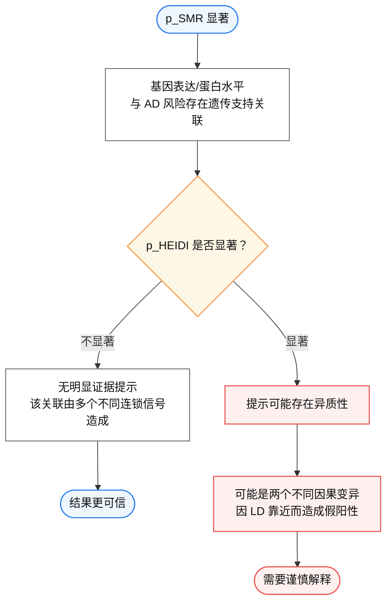

## 1 HEIDI 检验
**HEIDI**，全称 **HEterogeneity In Dependent Instruments**，中文可译为“依赖工具变量中的异质性检验”。HEIDI 是 **SMR（Summary-data-based Mendelian Randomization）** 方法体系中的配套检验，由 Zhu 等人[^1]在 2016 年提出，用于评估 SMR 分析得到的阳性结果是否可能由连锁不平衡（linkage disequilibrium, LD）导致的假阳性关联造成。

它是 SMR 配套的异质性检验，用来判断 SMR 发现的“基因表达/蛋白水平与疾病风险关联”是否可能只是由 LD 造成的假象。

### 1.1 基本定义
HEIDI 检验用于判断：
> GWAS 信号与 QTL 信号是否更可能来自同一个遗传变异，还是来自两个不同但相互连锁的遗传变异。
在 SMR 分析中，研究者通常整合两类汇总统计数据：
```
GWAS：SNP 与疾病/复杂性状的关联
QTL：SNP 与基因表达、蛋白水平、甲基化或剪接等分子性状的关联
```
如果某个基因表达量或蛋白水平的 SMR 结果显著，说明其遗传预测变化与疾病风险存在统计关联。但这种关联可能有两种解释：
```
情况1：同一个遗传变异同时影响QTL和疾病风险
情况2：两个不同遗传变异分别影响QTL和疾病风险，但二者处于LD中
```
HEIDI 检验主要用于识别第二种情况。
简单说：

### 1.2 名称含义
这里每个词都有意思：
```
Heterogeneity：异质性
Dependent：不是独立的
Instruments：工具变量，也就是SNP
```
为什么说 SNP 是“dependent instruments”？
因为 HEIDI 用的是同一个基因附近的一组 cis-eQTL SNP，这些 SNP 彼此之间往往存在 LD，也就是连锁不平衡，所以它们不是相互独立的工具变量。

### 1.3 HEIDI 到底检验什么？

他不是检验“基因 X 是否真的导致 AD”，而是检验：SMR 发现的“基因 X 表达与 AD 风险相关”，是不是可能只是两个不同遗传信号因为 LD 靠在一起造成的假象。

**情况 A：共享同一个因果变异，比较可信**
```
SNP rs1
↓
影响基因X表达
↓
同时与AD风险相关
```
或者更宽松地说：同一个遗传变异同时驱动 eQTL 信号 和 AD GWAS 信号
这时，附近一组和 rs1 存在 LD 的 SNP，应该表现出比较一致的关系：
- SNP对基因表达的效应越强
- SNP对AD风险的效应也按相同比例变化

也就是不同 SNP 算出来的 MR ratio 应该相对一致。

**情况 B：两个不同因果变异，只是 LD 造成假象**
```
SNP rs1 → 影响AD风险
SNP rs2 → 影响基因X表达
rs1 和 rs2 有LD
```
这时看起来 AD GWAS 信号和 eQTL 信号在同一区域“重叠”，但它们其实不是同一个因果变异导致的。
这种情况下，附近多个 SNP 算出来的关系会不一致，也就是有异质性。HEIDI 就是用来检验这种异质性的。
### 1.4 它怎么检验？

设：
x=基因 X 表达量
y=AD 风险
z=SNP

对于某个区域内多个 SNP，每个 SNP 都有两类效应
- b_zx：SNP 对 基因表达 的效应，来自 eQTL
- b_zy：SNP 对 AD 风险 的效应，来自 GWAS

如果是同一个遗传信号驱动，那么不同 SNP 的比例应该差不多：
- b_zy / b_zx ≈ 一个共同值
``

这个共同值就是 SMR 估计的基因表达变化 与 AD 风险 的遗传关联效应
HEIDI 会拿同一区域里多个 cis-eQTL SNP 来检查：每个SNP算出来的 b_zy / b_zx 是否一致？
如果一致：HEIDI 不显著，p_HEIDI > 0.05；说明没有明显异质性，更支持“同一个遗传信号”解释。
如果不一致：HEIDI 显著，p_HEIDI < 0.05；说明这些 SNP 给出的比例差异很大，提示可能是两个不同因果变异因为 LD 靠在一起造成的假象。

**举个例子**

假设 GENE-X 附近有 3 个 SNP：
```
SNP    对GENE-X表达效应 b_zx    对AD风险效应 b_zy    比值 b_zy/b_zx
rs1    0.50                  0.25              0.50
rs2    0.30                  0.15              0.50
rs3    0.10                  0.05              0.50
```
这就很一致，像是同一个遗传信号在驱动。
再看另一种：
```
SNP    对GENE-X表达效应 b_zx    对AD风险效应 b_zy    比值 b_zy/b_zx
rs1    0.50                  0.25              0.50
rs2    0.30                 -0.02             -0.07
rs3    0.10                  0.20              2.00
```
这就不一致，说明可能有异质性。HEIDI 会倾向于提示这个 SMR 结果不稳。

**要特别注意**
HEIDI 不显著不等于证明：
```
基因X表达一定导致AD
```
它只能说：
```
没有发现明显证据表明SMR结果是由LD异质性造成的
```
更严谨的表述是：
> SMR 显著且 HEIDI 检验不显著，提示该基因表达/蛋白水平与 AD 风险之间存在较可信的遗传支持关联，并降低了连锁不平衡导致假阳性的可能。

- [SMR | Yang Lab](https://yanglab.westlake.edu.cn/software/smr/#Overview)

[^1]: Zhu, Z., Zhang, F., Hu, H. _et al._ Integration of summary data from GWAS and eQTL studies predicts complex trait gene targets. _Nat Genet_ **48**, 481–487 (2016). https://doi.org/10.1038/ng.3538